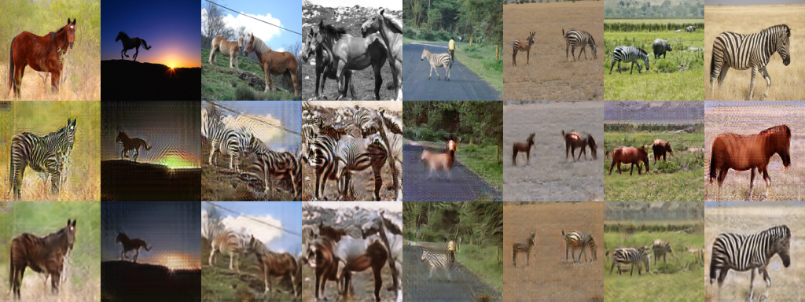

# CycleGAN
## Collection of Cycle Generative Adversarial Network implementations

Most codes are for python3, most notebooks works on 

### CycleGAN
* CycleGAN-tensorflow(https://github.com/vanhuyz/CycleGAN-TensorFlow)
* CycleGAN-keras()
* CycleGAN-paper(https://arxiv.org/pdf/1703.10593.pdf)
* CycleGAN-torch(https://github.com/junyanz/CycleGAN)
* CycleGAN-pytorch(https://github.com/junyanz/pytorch-CycleGAN-and-pix2pix)
* Understanding and Implementing CycleGAN in TensorFlow(https://hardikbansal.github.io/CycleGANBlog/)


### CycleGAN results
 
Result after 3 hours and 58 epochs on a GTX 1080. From top to bottom: Input, Fake, Recreate of the input.

 
Face-off result. From top to bottom: Input, Fake, Recreate of the input.
[youtube video](https://www.youtube.com/watch?v=Fea4kZq0oFQ)

&nbsp;

## Getting Started
#### 1. Clone the repository and download two videos
```bash
$ git clone https://github.com/Tim810306/CycleGAN.git
$ cd CycleGAN/
```
#### 2. Convert the video into frames
Change the file name in convert.py
```bash
$ python convert.py
```
Then images of frame will be show up!

